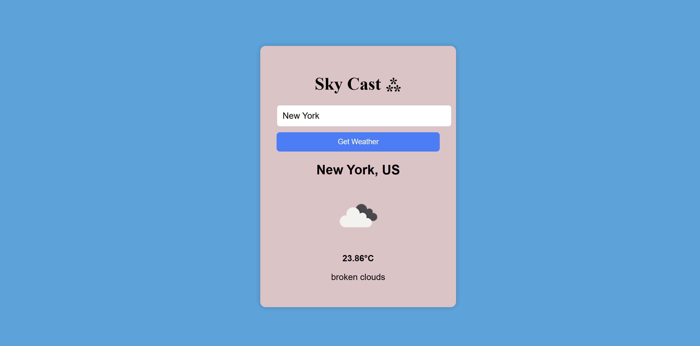

# SkyCast
SkyCast – Real-time weather info for any city with a clean, responsive design.

SkyCast is a simple and responsive web application that shows real-time weather information for any city using the OpenWeatherMap API.

## Features

- Search for any city and get the current temperature, weather description, and icon.
- Handles invalid city names with user-friendly error messages.

## Technologies Used

- HTML, CSS, JavaScript (Fetch API)
- OpenWeatherMap API
  Uses an API key to fetch and show weather data from an external service.

## How to Use

1. Clone or download this repository.
2. Open the `index.html` file in your browser.
3. Enter a city name in the search box and press Enter or click the search button.
4. View the current weather details.

## Screenshots

